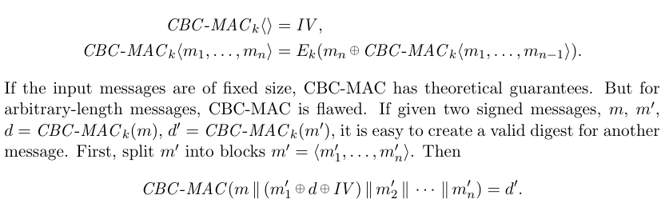
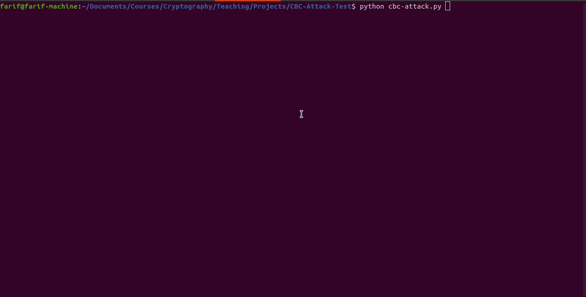

## CBC-MAC (Length Extension Attack)

------------------------
Implemented an attack against basic CBC-MAC showing that CBC-MAC for variable length messages is not secure to authenticate or verify messages of variable lengths. Please find the details on about [Length Extension Attack](https://en.wikipedia.org/wiki/Length_extension_attack).

An adversary can obtain tags (with respect to some unknown key) for any 2-block (32-byte) messages of your choice and the goal is to forge a valid tag for a 4-block (64-byte) message. For example, we used this message in example: 
```I, the server, hereby agree that I will pay $100 to this student```

### Attack Theory:
Here I describe the theory behind this attack:



Simply execute the attack using the command:

```#python sample.py messages/*```

If your program is successful then the verify server is tricked and will return '1' for that forged message.

### Demo:
Here is the Demo:



#### Dependencies (Setup):

For installing dependencies to run the above code, please run this script:

```#./setup```
